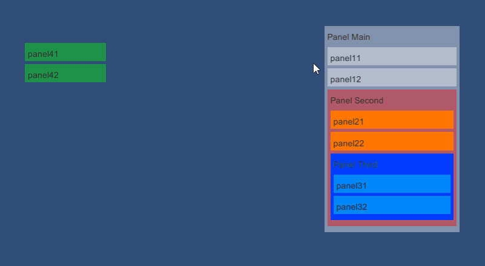

# Unity-UI-Nested-Drag-and-Drop
This is a simple project for nested drag and drop with Unity UI. It uses two C# scripts, UIDrag and UIDrop

# UIDrag
Insert this script in the UI objects that are alowed to be dragged and moved around.

# UIDrop
Insert this script in the UI objects that are used as containers for other UI objects.
To get the best out of the Drag and Drop, all the UI objects that are used as containers for other UI objects should have a Layout Group on it to organize the content. There's a Vertical Layout Group already added to the UI objects of the project, however, you can change it to fit your needs.

# See in action

